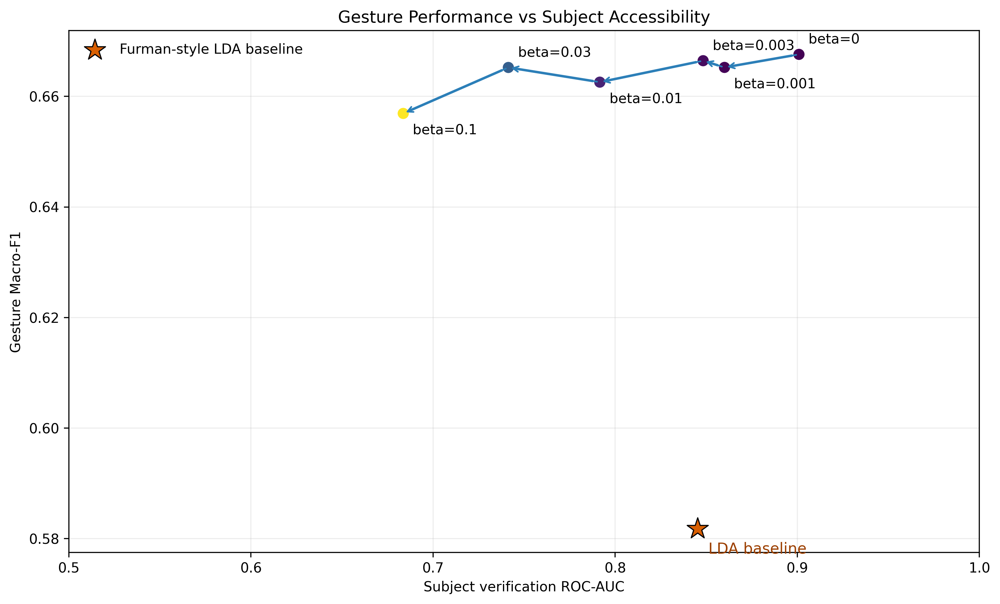

# sEMG Information Bottleneck

**확률적 bottleneck 구조를 설계하고, 정보량 제약과 학습 목표가 sEMG 표현에 남기는 정보를 어떻게 바꾸는지 검증한 연구입니다.**

## Problem

sEMG에는 동작 정보와 사람마다 다른 신호 특성이 함께 담깁니다. Latent 차원을 줄이는 것만으로 원하는 정보만 남는다고 볼 수 없어, 통과 정보량과 학습 목표를 각각 조절할 구조를 조사했습니다.

## My Contribution

- 입력을 확률적 latent로 변환하는 **Stochastic Bottleneck architecture**를 설계했습니다.
- KL Rate를 정보 통로의 제약으로 사용하고, Gesture / Subject / Joint supervision을 비교하는 평가 구조를 설계했습니다.
- 정보량 제약과 학습 목표를 분리해 조절하며 representation에서 읽을 수 있는 정보가 어떻게 달라지는지 분석했습니다.

## How It Works

```text
sEMG feature → Encoder → Gaussian latent z → Gesture prediction
                         └─ KL constraint: information-rate proxy
Supervision target: Gesture / Subject / Joint
```



*Seed-0 beta sweep의 기존 그림입니다. Subject AUC는 특정 verification probe의 접근성 지표이며, subject 정보 제거를 뜻하지 않습니다.*

## Key Finding / Result

- Latent dimension 축소만으로는 정보량을 충분히 제한하지 못했지만, KL 제약은 Mean KL을 낮출 수 있었습니다.
- 별도 5-seed rate-matched 분석에서 세 supervision 조건의 Gesture Macro-F1 ordering은 5/5 seeds에서 유지됐고, 15/15 조건이 목표 rate의 5% 이내였습니다. Gesture Macro-F1은 G **0.6666 ± 0.0020**, GS **0.5673 ± 0.0098**, S **0.1011 ± 0.0018** (seed-level mean ± sample SD)였습니다.
- 별도의 seed-0 beta sweep에서는 Mean KL이 **127.96 → 2.50**으로 변했습니다. 이 값은 5-seed 결과와 다른 분석 버전의 기술 통계이며 서로 합산하지 않습니다.

이 결과는 KL이 정확한 mutual information이라는 뜻이 아니며, subject 정보 제거·disentanglement 또는 인과 효과를 입증하지 않습니다.

## Technical Notes

- 주요 프로토콜은 42-subject strict LOSO, 528-D handcrafted feature, fold별 train-only scaling, posterior-mean 평가입니다. Sampled-Z 진단은 별도 결과입니다.
- 5-seed 집계와 seed-0 sweep의 provenance 및 제한은 [`CAMERA_READY_MULTISEED_REPORT.md`](docs/CAMERA_READY_MULTISEED_REPORT.md), [`TRADEOFF_CONSOLIDATED_REPORT.md`](docs/TRADEOFF_CONSOLIDATED_REPORT.md), [`CAMERA_READY_FINAL_DECISION.md`](docs/CAMERA_READY_FINAL_DECISION.md)에 기록했습니다.
- 이 선별 저장소는 모델 참조 코드와 집계 자료만 담고 있어 전체 학습을 재현할 수 없습니다. KoreaAI 2026은 **1차 심사 통과** 상태이며, 정식 게재·발표를 의미하지 않습니다.
